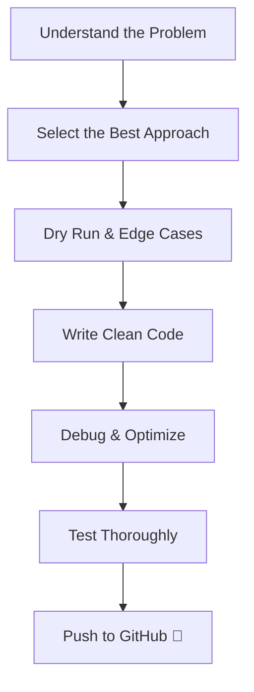
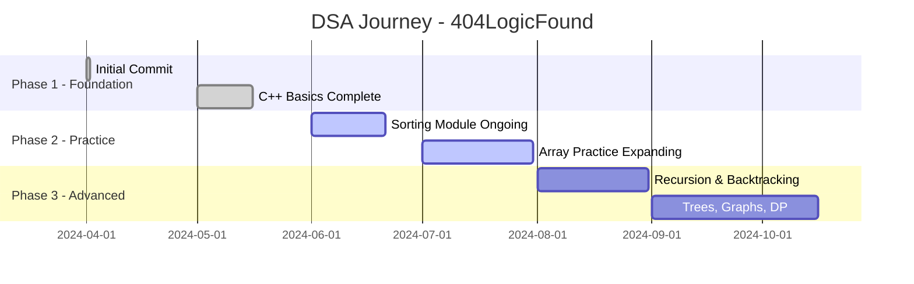

# ⚡ 404LogicFound — My Personal DSA Lab

> *“Logic isn’t lost. It’s being built here — problem by problem, day by day.”*


---

## 📘 Overview

**404LogicFound** is a curated collection of my daily practice in **Data Structures & Algorithms (DSA)** using **C++**. This isn't just code — it's a complete **learning journey**:

- 🚀 Built from scratch with real logic
- ✅ Tested with edge & custom cases
- 💬 Explained via meaningful comments
- 📈 Committed with clean version history

---

## 📂 Folder Structure

```
404LogicFound/
├── 01_cppBasics       # C++ syntax, loops, conditionals, I/O
├── 02_Sorting         # Sorting algorithms: bubble, selection, insertion, etc.
├── 03_Array           # Array problems: Two Sum, Max Element, etc.
└── README.md          # This file
```

> Each folder contains well-documented, self-contained C++ files.

---

## 🧠 Topics Covered

| Category              | Status        |
|------------------------|---------------|
| ✅ C++ Fundamentals     | Completed     |
| 🔁 Sorting Algorithms   | In Progress   |
| 🔁 Array Problems       | Expanding     |
| 🧩 Advanced DSA         | Coming Soon   |

> ✨ Upcoming: Recursion, Linked Lists, Trees, Graphs, Backtracking, Dynamic Programming, and Interview Patterns.

---

## ⚙️ Tools & Technologies

| Purpose             | Tools/Technologies       |
|----------------------|---------------------------|
| Language             | C++ (Modern Standard)     |
| IDEs                 | VS Code, OnlineGDB        |
| Version Control      | Git & GitHub              |
| Docs & Diagrams      | Markdown, Mermaid.js      |

---

## 🔄 Problem-Solving Workflow



---

## ✅ Commit Style & Conventions

```bash
✅ Add: Optimized solution for Two Sum
🧪 Test: Added edge + stress cases
📝 Docs: Included time & space complexity
```

> 📌 Every commit is descriptive and focused — making the repo easy to navigate and learn from.

---

## 📊 Learning Timeline



---

## 🌐 Why the Name "404LogicFound"?

A fun twist on the classic **404 Not Found** error —  
But here, logic is **always found**, explained, tested, and version-controlled.

---

## 🎯 My Goals

- 🧠 Build strong core DSA concepts
- 💻 Prepare effectively for coding interviews
- 📚 Develop a reference-friendly GitHub archive
- 🧪 Promote clean, explainable problem-solving
- 🧱 Establish consistent learning & versioning habits

---

## 💡 How to Use This Repo

- 📖 Browse solved problems by topic
- 💡 Learn patterns & techniques from scratch code
- 🔁 Fork the repo and practice by replacing my logic with yours
- ✍️ Suggest better approaches via PRs or issues

---

## 🙌 Contributions & Feedback

Pull Requests, Issue Reports, and Ideas are always welcome!

```bash
📢 Want to collaborate or contribute?
→ Fork the repo
→ Solve a new problem or improve an existing one
→ Submit a Pull Request
```

---

## 🤝 Let's Connect

- 👨‍💻 GitHub: [@RaoVrn](https://github.com/RaoVrn)
- ✨ Drop a ⭐ if you found this useful or inspiring
- 💬 Open to discussions, feedback, and collaborations

---

> _“First, solve the problem. Then, write the code.” – John Johnson_  
> That’s the heart of this repository.

---

**Thanks for stopping by — keep coding and keep growing! 💪⚡**
